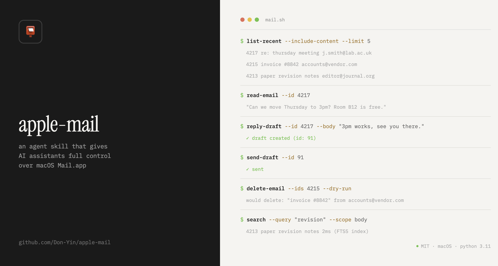

<a href="https://github.com/openclaw"></a>

[English](README.md)

# apple-mail



让 AI 帮你管邮件的 agent skill。收件箱整理、写回复、搜索、归档、删除，说句话就搞定。

支持 Cursor、Claude Code、OpenClaw 等所有能跑 shell 的 AI agent。

## 安装

```bash
# cursor
git clone https://github.com/openclaw/apple-mail.git .cursor/skills/apple-mail

# claude code
git clone https://github.com/openclaw/apple-mail.git .claude/skills/apple-mail

# openclaw
git clone https://github.com/openclaw/apple-mail.git .openclaw/skills/apple-mail
```

前置条件：macOS 上配好 Mail.app、装好 [micromamba](https://mamba.readthedocs.io/en/latest/installation/micromamba-installation.html)、终端开启"完全磁盘访问权限"。首次运行自动建 Python 3.11 环境，不用手动装。

## 原理

- 直接读磁盘上的 `.emlx` 文件，每封约 5 ms，比走脚本桥接快几十倍
- 读不到时自动回退到 JXA
- 自带 SQLite FTS5 全文索引，搜索很快
- 删除、改标题等操作都有日志，支持 `--dry-run` 先看后做
- 不确认就不发，所有发送必须用户点头

完整命令文档见 `SKILL.md` 和 `references/tool-reference.md`。

## 致谢

磁盘直读和 FTS5 搜索索引的思路来自 [imdinu/jxa-mail-mcp](https://github.com/imdinu/jxa-mail-mcp)。

## 许可证

MIT
